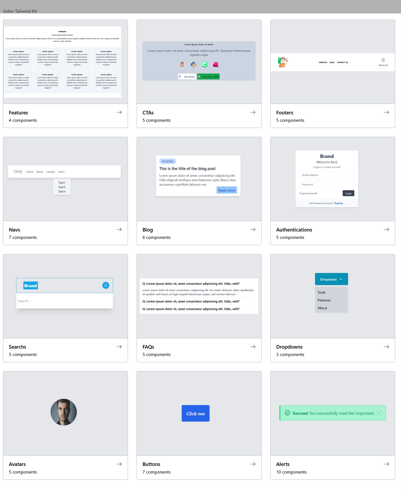

+60 Tailwind CSS components.

-  Responsive
-   Dark Mode 

---


Components hosted on [ilyatdo.ml](https://ilyatdo.ml).



---

## Folder structure

```
├───components
│   ├───Alerts
│   ├───Authentications
│   ├───Avatars
│   ├───blog
│   ├───Buttons
│   ├───CTAs
│   ├───Dropdowns
│   ├───FAQs
│   ├───Features
│   ├───Footers
│   ├───Headers
│   ├───Navs
│   └───Searchs
├───images
└───src
```

---

## Licence

Under the MIT License (MIT). Check [License File](https://github.com/merakiui/merakiui/blob/main/LICENSE) for more information.

## Inspiration

[Merakiui](https://merakiui.com/)

[TailBlocks](https://tailblocks.cc/)